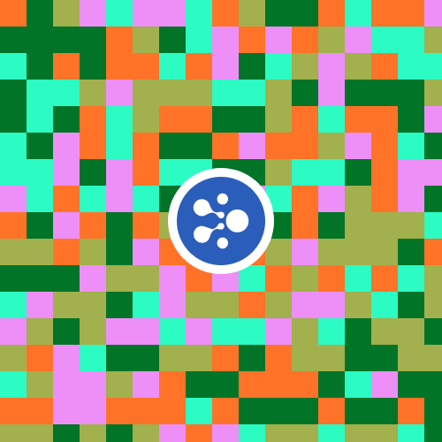

# Aelf Pixels - NFT collection on Aelf blockchain + 3D gallery

<i>Mint and become a owner of unique NFT items on Aelf blockchain that you can admire in a 3D gallery or send to others.</i>

---------

### Presentation:

- Live demo: [https://aelf-nft-pixels.netlify.app](https://aelf-nft-pixels.netlify.app)
- Video demo: [https://www.youtube.com/watch?v=wCjArQlgfng](https://www.youtube.com/watch?v=wCjArQlgfng)

----------

### Project description:

Aelf Pixels is an NFT contract deployed in Aelf blockchain. This contract is implementation of ERC-721 standard (standard that describes how to build non-fungible tokens on the EVM blockchains). One of the differences is this: in EVM networks, contracts are written in Solidity, but in AELF they are written in C#.

#### Description of project sections:

- **Home page:** Contains brief information about the project;
- **Mint page:** Here, users can mint a new NFT. The NFT itself is a square picture filled with pixels (a few examples of such NFTs can be seen below). The color and size of the pixels can be selected, and when the corresponding button is pressed, a new image is generated with random colors for the pixels. After connecting the wallet, users can mint NFTs;
- **My NFTs page:** On this page, owners of Aelf Pixels can view their collection, as well as transfer certain NFTs to another address;
- **3D gallery:** This is a 3D gallery in the browser, where the owners of Aelf Pixels can also look at their collection, but in 3D form. Users can walk through this gallery and admire the NFTs on the gallery walls using the keyboard (WASD) and mouse.

----------

### What was used?

1. AElf tools:
    * [**aelf-sdk.js**](https://github.com/AElfProject/aelf-sdk.js) - Javascript development kit for interacting with an AElf node;
    * [**aelf-boilerplate**](https://github.com/AElfProject/aelf-boilerplate) - an environment for smart contract and dApp development;
    * [**aelf-command**](https://github.com/AElfProject/aelf-command) - CLI tool for interacting with an AElf node and wallet;
    * [**aelf-web-extension**]() - Web extension for interacting with a smart contract through dApp;
2. [**Infura IPFS**](https://infura.io/product/ipfs);
3. [**Three.js**](https://threejs.org) - Library for creating the 3D gallery;
4. [**cannon.js**](https://github.com/schteppe/cannon.js) - Lightweight 3D physics for the web;

----------

### Examples of generated Pixels:

1           |  2 |  3 |  4
:-------------------------:|:-------------------------:|:-------------------------:|:-------------------------:
  |   |   |  

----------

### Demo screens:

**Home page** | **Mint page**          
:-------------------------:|:-------------------------:
  |  
**My NFTs page** | **3D gallery**
 |   

